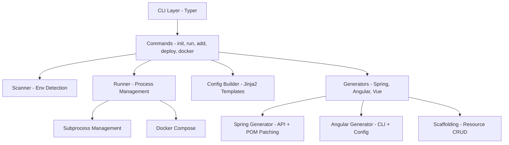
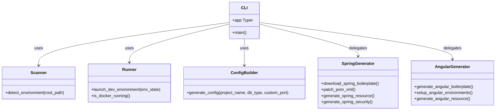
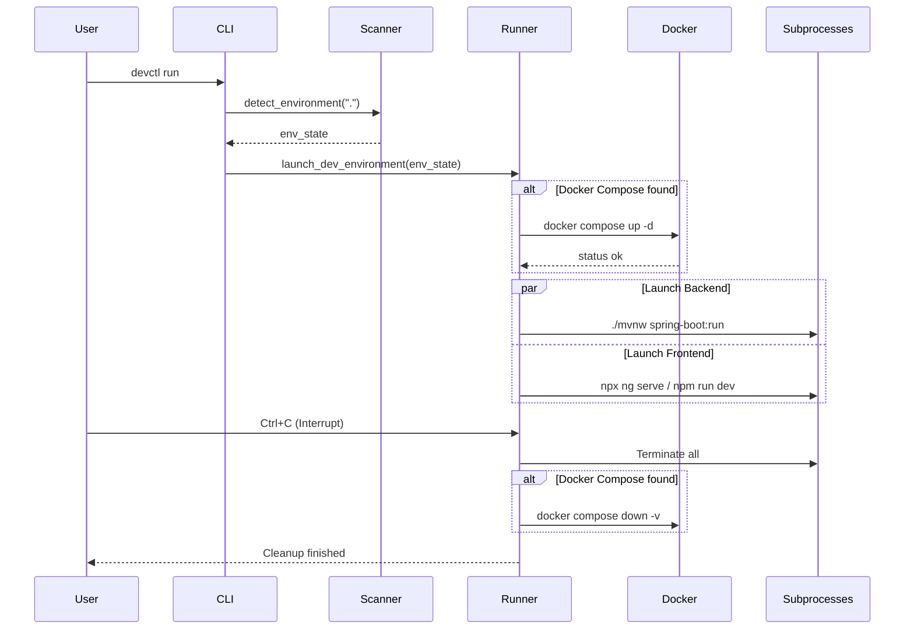
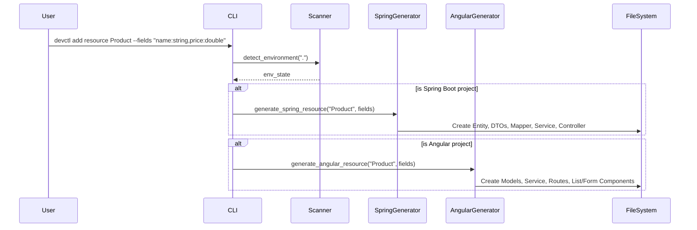

# Devctl core engine documentation

This documentation describes the internal architecture of the `devctl` core
engine, including the implementation of the CLI, orchestrator, and
generators.

## System architecture

`devctl` is a modular CLI application. The CLI layer delegates tasks to
specialized orchestrators and generators.

## Class and module diagram

The tool organizes logic into modules that function as services.

## Sequence diagram: `devctl run`

The following diagram illustrates the lifecycle of the `run` command for local
orchestration.

## Sequence diagram: `devctl add resource`

The scaffolding command handles cross-stack code generation.

## Key concepts

### 1. Intelligent environment scanning

The `Scanner` searches for signature files such as `pom.xml`, `angular.json`,
or `docker-compose-db.yml`. This allows the CLI to be context-aware and run
commands relative to project roots without complex configuration.

### 2. Parallel process management

The `Runner` uses `subprocess.Popen` to launch backend and frontend services
concurrently. It manages a graceful shutdown sequence upon receiving a
termination signal, ensuring no zombie processes remain.

### 3. Surgical POM patching

The `SpringGenerator` uses Python's `xml.etree.ElementTree` to inject
dependencies and annotation processors into the `pom.xml` file. This preserves
user changes while ensuring required libraries are present.

### 4. Jinja2 templating

Code generation relies on Jinja2 templates. This separates generation logic
from boilerplate code, facilitating updates to the generated structure.

### 5. Multi-tier scaffolding mapping

The generators translate simple field definitions into language-specific types.
The tool then generates a full vertical slice, including backend entities,
services, and controllers, along with frontend components and models.
