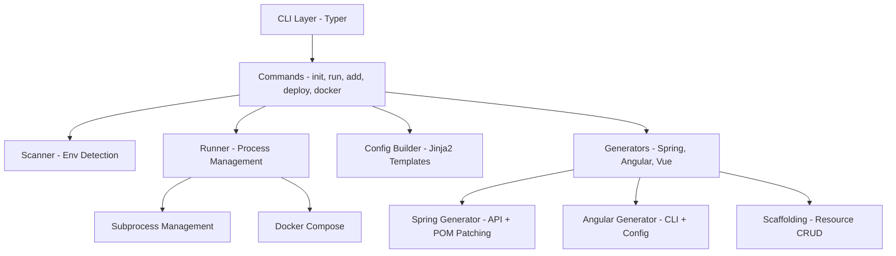
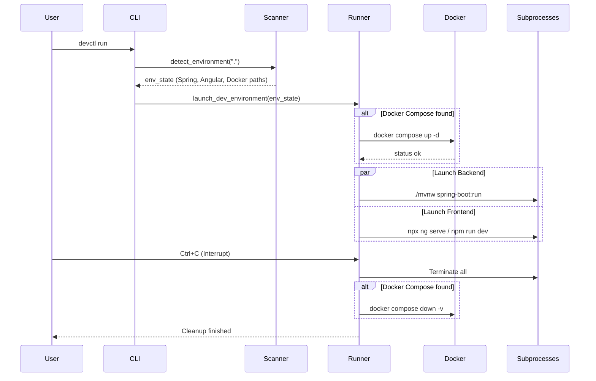
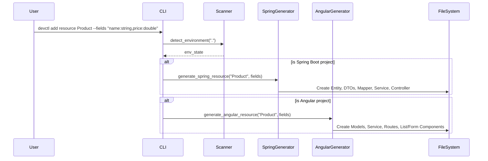

# devctl: Core Engine Documentation

Welcome to the internal documentation of the **devctl** core engine. This directory contains the implementation of the CLI, orchestrator, and generators.

## 🏗️ System Architecture

`devctl` is designed as a modular CLI application. It follows a layered approach where the CLI commands delegate work to specialized orchestrators and generators.

## 📂 Class & Module Diagram

While Python is often functional, `devctl` organizes its logic into logical modules that act as services.

## 🔄 Sequence Diagram: `devctl run`

The following diagram illustrates the lifecycle of the `run` command, which is the heart of the local orchestration.

## 🔄 Sequence Diagram: `devctl add resource`

The scaffolding command handles generating code across the entire stack.

## 💡 Key Concepts & Code Explanations

### 1. Intelligent Environment Scanning (`orchestrator/scanner.py`)
The `Scanner` uses `os.walk` to find signature files:
- `pom.xml` or `mvnw` -> **Spring Boot**
- `angular.json` -> **Angular**
- `vite.config.ts/js` -> **Vue.js**
- `docker-compose.yml` -> **Docker**

This allows the CLI to be "context-aware" and run commands relative to the detected project roots, avoiding the need for complex configuration files. It specifically ignores heavy directories like `node_modules` or `.git` to keep the scan instantaneous.

### 2. Parallel Process Management (`orchestrator/runner.py`)
The `Runner` utilizes `subprocess.Popen` to launch multiple long-running processes (Spring, Angular, Vue) in parallel. It maintains a list of these processes and handles a graceful shutdown sequence upon receiving a `KeyboardInterrupt` (Ctrl+C). It explicitly sends termination signals and waits for the processes to close, ensuring no "zombie" processes are left running, and cleans up Docker volumes if a compose file is present.

### 3. Surgical POM Patching (`generators/spring.py`)
Instead of overwriting files or using regex string replacement, the `SpringGenerator` uses Python's built-in `xml.etree.ElementTree` to surgically inject dependencies (like JJWT and MapStruct) and annotation processors into the `pom.xml`. This preserves user-made changes while ensuring the necessary libraries for `devctl` scaffolding are present when a new Spring backend is initialized.

### 4. Jinja2 Templating
All code generation (scaffolding) relies on **Jinja2** templates found in `devctl/templates/`. This separation of logic and boilerplate makes it easy to update the generated code structure without touching the Python logic.

### 5. Multi-Tier Scaffolding Mapping (`generators/scaffold_*.py`)
When running `devctl add resource`, the generators parse the provided fields (e.g., `name:string, price:double`). The CLI maintains maps (e.g., `JAVA_TYPE_MAP` and `TS_TYPE_MAP`) to translate simple types into the correct language-specific types (e.g., `string` -> Java `String` and TypeScript `string`; `date` -> Java `LocalDate` and TypeScript `string`). It then generates a full vertical slice:
- **Spring**: Entity, Repository, Service, ServiceImpl, Controller, DTOs, and Mapper.
- **Angular**: Components (List/Form), Service, Models, and Routes.